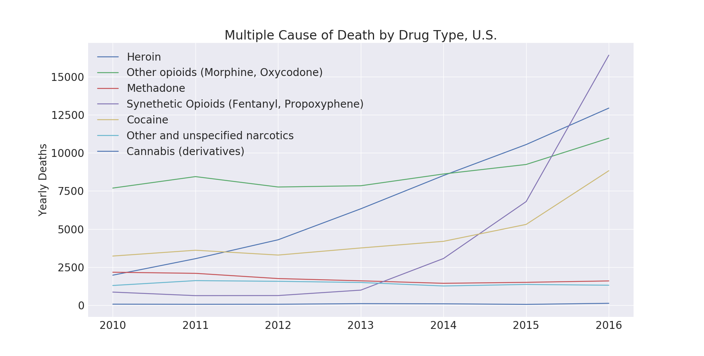
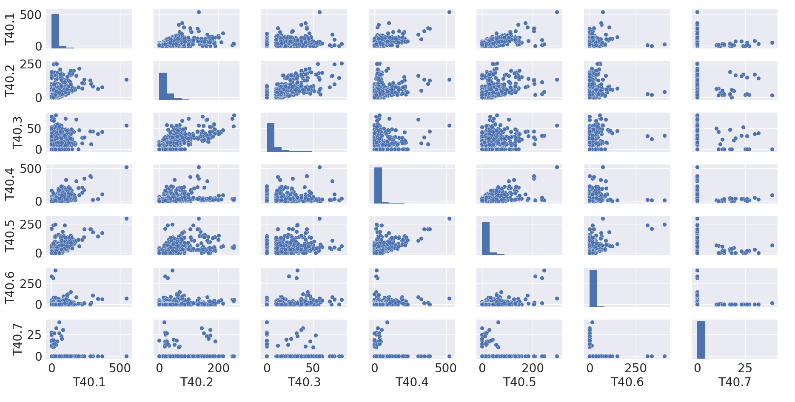
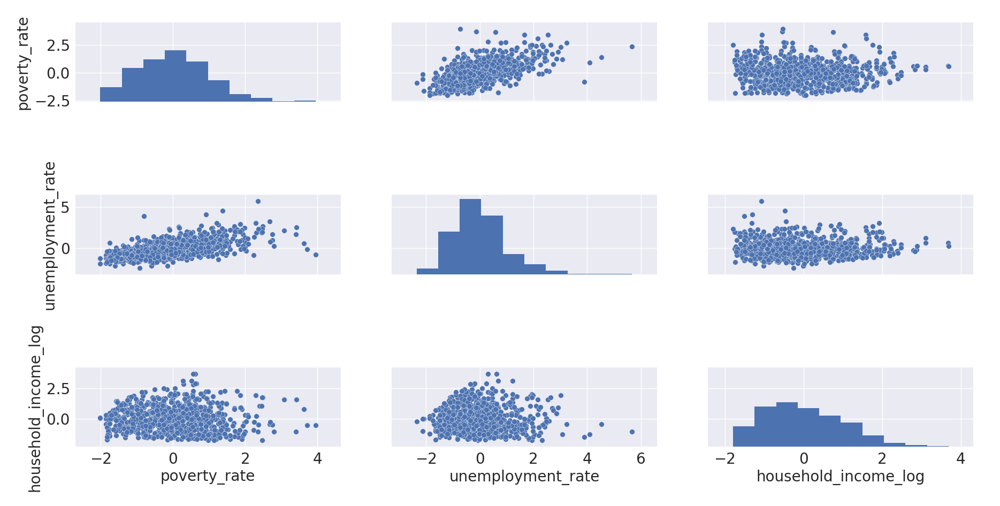

# overdose_CDC

## Data
Overdose Data was gathered from the CDC WONDER Database using the T40 (Poisoning by narcotics and psychodysleptics) classifier for Multiple Cause of Death, by county, year(2010-2016) and drug  
Economic Data was gathered from the Census Bureau American Community Surveys by county and year(2015-2016)
Facts included are Unemployment Rate for Adults 16+, Total Household Income Estimate, and Percent Below Poverty Level

## EDA
Plotting deaths over the years showed a trend where all drug deaths increased from 2013 to 2016, with a notable increase in synthetic opioids. In addition, both fentanyl and cocaine had a large increase in deaths from 2015 to 2016.

County analysis showed that the highest overall MCD drug deaths were in Kentucky and West Virginia, while Washington County was in the top five for both overall and synthetic deaths.

| county_code|            death_ratio  |               county|
| ---------  |----------------------- | --------------------- |
|21197.0|         1.030683|      Powell County, KY|
|54047.0|         0.910671|    McDowell County, WV|
|23029.0|         0.890302|  Washington County, ME|
|54109.0|         0.818653|     Wyoming County, WV|
|54005.0|         0.793864|       Boone County, WV|

| county_code|            synthetic_ratio  |               county|
| ---------  |----------------------- | --------------------- |
|21097.0|             0.589939|    Harrison County, KY|
|23029.0|             0.476948|  Washington County, ME|
|21081.0|             0.401236|       Grant County, KY|
|24001.0|             0.346596|    Allegany County, MD|
|39027.0|             0.310137|     Clinton County, OH|

A scatter matrix comparing distributions for T40 MCD codes signified linear relationships between many of the codes; this is expected as each category is not exclusive and an autopsy can often list more than one drug as an MCD. Notable relationships are seen between T40.2 (Methadone ) and T40.3(Other Opioids), and T40.4 (Synthetic Opioids) and T40.5 (Cocaine).

For census data, a scatter matrix revealed a relationship between poverty rate and unemployment_rate, as well as a relationship of those two with the log of households income(taken because income was not normally distributed)

## Hypothesis Testing
A two-way analysis of variance _factors(year, drug(cocaine, synthetic opioids))_
df showed that while there was not a significant difference for the mean number of deaths for each drug across all years (_F_=0.07, _p_=0.79), there was a significant interaction between cocaine and synthetic deaths (_F_ = 3.75, _p_=0.08), where deaths by each drug increased by a function of each other eash subsequent year. There was a significant effect of year(_F_ = 15.73, _p_<0.01), where deaths increased from 2010 to 2016.

## Modeling
A subset of the data consisting of all counties with recorded non-zero synthetic opioid deaths (T40.4) in 2015 and 2016 was chosen to model on. The target consisted of each observation of T40.4 deaths, and the features were selected from the remaining drug codes (T40.1 - T40.3, T40.5 - T40.7) as well as county population, household income, and unemployment and poverty rates.
Because county X year observations were missing values, a comparison of various imputation methods resulted in a K-nearest neighbors (_k_ = 5) as the most best fit for the data. 1,794 missing values were imputed using this technique.
The data was then standardized and tested for homoscedasticity using Goldfeld-Quandt (_F_: 1.07, _p_:0.29).

Multicolinearity was tested by computing the Variance Inflation Factor for each feature, given by the following table:  

|        features   | VIF Factor   |
|  --------------  | -------------
|         population |    2.56 |
|              T40.1 |    3.28 |
|              T40.2 |    2.91 |
|              T40.3 |    2.28 |
|              T40.5 |    3.28 |
|              T40.6 |    1.23 |
|              T40.7 |    1.32 |
|   household_income |    2.15 |
|       poverty_rate |    2.67 |
|  unemployment_rate |    1.62 |
