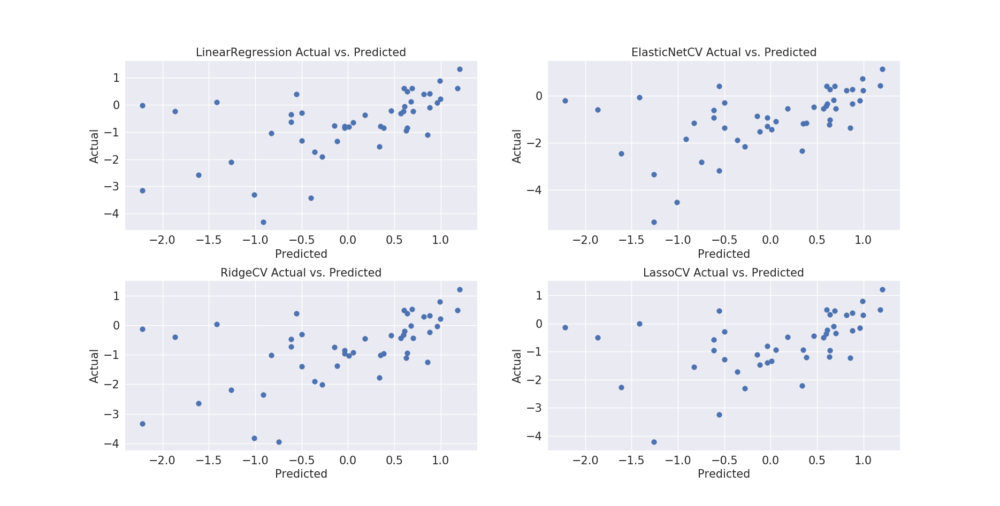

# Synthetic Opioid Overdose Predictions

## Overview
Opioid overdoses cause the death of over 100 Americans everyday, with the number climbing higher each year. The opioid epidemic began in the 1990s as prescription opioid painkillers became widespread. More recently, the introduction of illicitly manufactured fentanyl, an opioid painkiller between 100 times stronger than morphine, has caused a large increase in the number of overdose deaths. Cocaine is often involved in synthetic opioid overdoses; though it is unclear if the victims have intentionally combined the two drugs or not. Some regions of the U.S. have much higher rates of overdose by synthetic opioids than others, and it is useful to be able to predict high risk counties. Using data from the Census Bureau and the CDC, I aim to create a model that will can accurately predict the number of synthetic opioid overdose deaths in a county utilizing a variety of demographic, health and economic data.

## Data
Overdose Data was gathered from the CDC WONDER Database using the T40 (Poisoning by narcotics and psychodysleptics) classifier for Multiple Cause of Death, by county, year(2010-2016) and drug.  
Economic Data was gathered from the Census Bureau American Community Surveys by county and year(2010-2016).
Variables are described in the following table:

|     Variable                  | Description |
|:------------------------------|-------:|
| population                    |  County Population       |
| T40.1                         | MCD: Heroid              |
| T40.2                         | MCD: Other Opioids (Oxycodone, Hydrocodone)     |
| T40.3                         | MCD: Morphine            |
| T40.5                         | MCD: Cocaine             |
| T40.6                         | MCD: Other Narcotics     |
| household_income              | Mean Household Income    |
| low_income_families           | % of families with yearly income < $15,000|
| poverty_rate_white            | % Poverty Rate: White    |
| poverty_rate_african_american | % Poverty Rate: African American  |
| poverty_rate_asian            | % Poverty Rate: Asian    |
| poverty_rate_hispanic         | % Poverty Rate: Hispanic |
| unemployment_rate             | Unemployment Rate        |
| disability_employed           | % of Disabled Residents Employed  |

## EDA
Plotting deaths over the years showed a trend where all drug deaths increased from 2013 to 2016, with a notable increase in synthetic opioids. In addition, both fentanyl and cocaine had a large increase in deaths from 2015 to 2016.
  

#### Hypothesis Testing
A two-way analysis of variance _factors: year(2010 - 2016) X drug(cocaine, synthetic opioids))_
df showed that while there was not a significant difference for the mean number of deaths for each drug across all years (_F_=0.07, _p_=0.79), there was a significant interaction between cocaine and synthetic deaths (_F_ = 3.75, _p_=0.08), where deaths by each drug increased by a function of each other eash subsequent year. There was a significant effect of year(_F_ = 15.73, _p_<0.01), where deaths increased from 2010 to 2016.

#### County Statistics
County analysis showed that the highest overall MCD drug deaths were in Kentucky and West Virginia, while Washington County was in the top five for both overall and synthetic deaths.

| county_code|            death_ratio  |               county|
| ---------  |----------------------- | --------------------- |
|21197.0|         1.030683|      Powell County, KY|
|54047.0|         0.910671|    McDowell County, WV|
|23029.0|         0.890302|  Washington County, ME|
|54109.0|         0.818653|     Wyoming County, WV|
|54005.0|         0.793864|       Boone County, WV|

| county_code|            synthetic_ratio  |               county|
| ---------  |----------------------- | --------------------- |
|21097.0|             0.589939|    Harrison County, KY|
|23029.0|             0.476948|  Washington County, ME|
|21081.0|             0.401236|       Grant County, KY|
|24001.0|             0.346596|    Allegany County, MD|
|39027.0|             0.310137|     Clinton County, OH|

A scatter matrix comparing distributions for T40 MCD codes signified linear relationships between many of the codes; this is expected as each category is not exclusive and an autopsy can often list more than one drug as an MCD. Notable relationships are seen between T40.2 (Methadone ) and T40.3(Other Opioids), and T40.4 (Synthetic Opioids) and T40.5 (Cocaine).

##### Associations between various drug death types

For census data, a scatter matrix revealed no clear associations between T40.4 and other predictors, though there was a correlation between poverty rates of various races.(Note: Some variables were removed from the model due to lack of sufficient data)

## Modeling
A subset of the data consisting of all counties with recorded non-zero synthetic opioid deaths (T40.4) in 2015 and 2016 was chosen to model on. The target consisted of each observation of T40.4 deaths, and the features were selected from the remaining drug codes (T40.1 - T40.3, T40.5 - T40.7) as well as county population, household income, and unemployment and poverty rates.
Because county X year observations were missing values, a comparison of various imputation methods resulted in a K-nearest neighbors (_k_ = 5) as the most best fit for the data. 2,960 missing values were imputed using this technique.
The data was then standardized and tested for homoscedasticity using Goldfeld-Quandt (_F_: 1.08, _p_:0.23); residuals were visually inspected with a QQ plot:  

Multicolinearity was tested by computing the Variance Inflation Factor for each feature, given by the following table:  

| Features                      |   VIF Factor |
|:------------------------------|-------------:|
| population                    |        2.553 |
| T40.1                         |        2.963 |
| T40.2                         |        2.912 |
| T40.3                         |        2.136 |
| T40.5                         |        3.033 |
| T40.6                         |        1.231 |
| household_income              |        2.836 |
| low_income_families           |        2.873 |
| poverty_rate_white            |        2.831 |
| poverty_rate_african_american |        1.777 |
| poverty_rate_asian            |        1.344 |
| poverty_rate_hispanic         |        1.771 |
| unemployment_rate             |        1.489 |
| disability_employed           |        2.761 |

Cross validations of hyperparameters (n_folds = 5) of ridge, lasso and elastic net models were run and fit scores were computed for each and compared to the standard linear model.

Results showed similar test R2 for all four linear models; the lasso model was chosen because of its simplicity of features:

|                          |   LinearRegression{} |   ElasticNetCV{'a': 0.11, 'l1_ratio': 0.118} |   RidgeCV{'a': 36.427} |   LassoCV{'a': 0.023} |
|:-------------------------|---------------------:|---------------------------------------------:|-----------------------:|----------------------:|
| Train_R2                 |                0.482 |                                        0.462 |                  0.476 |                 0.471 |
| Test_R2                  |                0.469 |                                        0.453 |                  0.466 |                 0.463 |
| Test_RSS                 |                0.522 |                                        0.542 |                  0.527 |                 0.533 |
| Train_RSS                |                0.519 |                                        0.534 |                  0.521 |                 0.525 |
| Unstandardized_Test_RSS  |               10.805 |                                       10.84  |                 10.821 |                10.827 |
| Unstandardized_Train_RSS |               11.316 |                                       11.331 |                 11.327 |                11.307 |

Predicted values for the test set were plotted against actual values with log transformations on both:

### Coefficients

Including data from 2013 - 2016

Lasso Coefficients indicated cocaine deaths as a strong predictor of synthetic deaths. Population had a negative coefficient, indicating that county population and synthetic deaths are inversely related; indeed, many of the top synthetic overdose death counties were not especially populous. Heroin (T40.1) and other opioids such as Oxycodone (T40.2) were also positive predictors.   

Unemployment rate was a positive predictor, which was unexpected given previous associations between employment and drug use, and further research is needed to understand this result. The percent of employed disabled people with disabilities was negatively correlated while other census data including poverty rate by race, household income and the percent of low income families were not strong predictors of synthetic opioid deaths.

|     Variable                  | Coefficient|
|:------------------------------|-------:|
| population                    | -0.342 |
| T40.1                         |  0.259 |
| T40.2                         |  0.166 |
| T40.3                         |  0     |
| T40.5                         |  0.405 |
| T40.6                         |  0     |
| household_income              |  0     |
| low_income_families           | -0.01  |
| poverty_rate_white            |  0     |
| poverty_rate_african_american | -0.042 |
| poverty_rate_asian            |  0.043 |
| poverty_rate_hispanic         |  0     |
| unemployment_rate             | -0.139 |
| disability_employed           | -0.112 |

## Summary
Overall, the model was able to attain a moderate ability to predict deaths by county; however, its predictive power lay mostly multiple cause of death features, which are not necessarily mutually exclusive. In order to improve the model, new predictors such as health data, drug usage, life satisfaction or others need to be explored.
